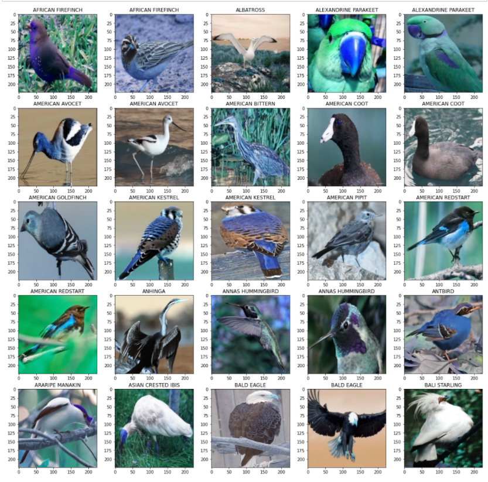
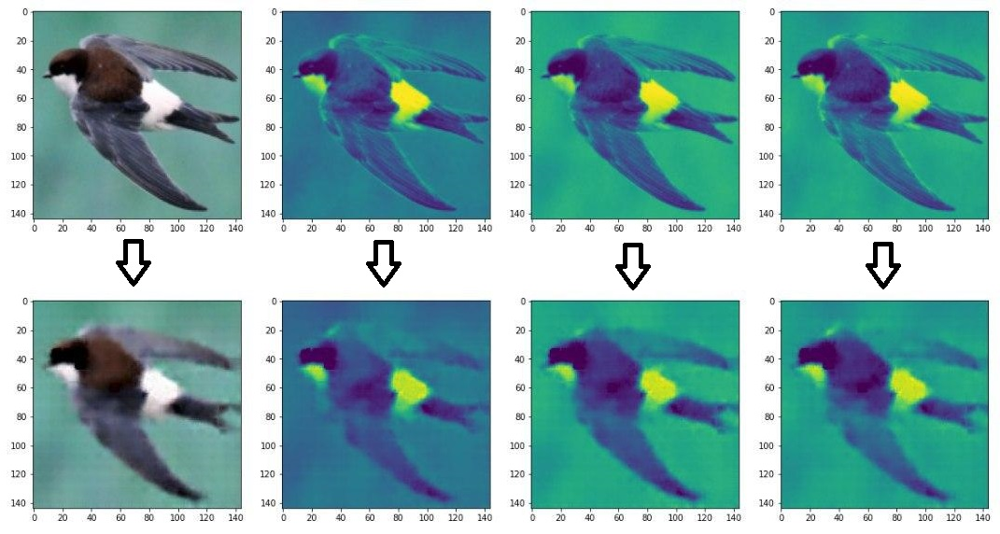
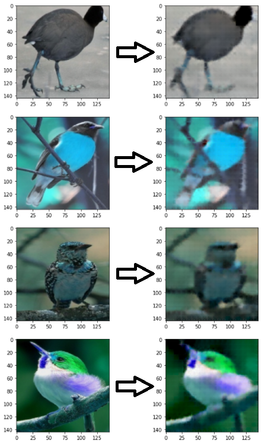
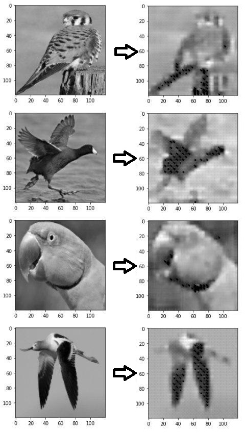
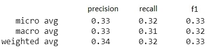
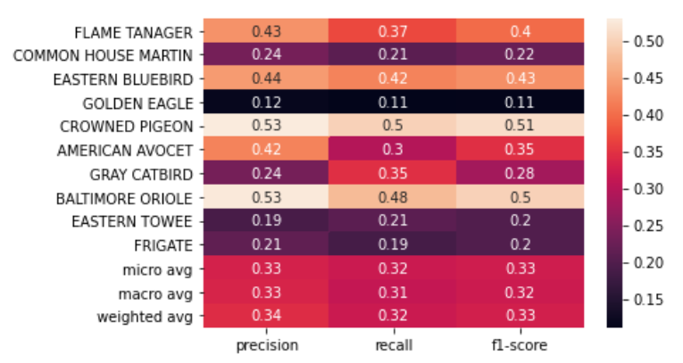

# CV project. Birds images classification.
## Done by Rinat Babichev and Dmitry Konev

This repository builds approaches for bird images classifications using kNN based on autoencoder embeddings, using "100-bird-species" dataset (https://www.kaggle.com/gpiosenka/100-bird-species)

## Dataset batch example

# How to use:
Repository contains birdClassification.ipynb file, which includes all code that we wrote.
All needed libraries will be installed during notebook launch. 

# Algorithm description:
1)  Train image auto-encoder from the dataset.
2)  Pass the data through the encoder part to get dimension-ality reduced data.
3)  Run kNN on embedded data.

## Auto-encoder
Images were grayscaled and resized.
Our  auto-encoder  consists  of  encoder  and  decoder. Encoder   is   expressed   by   3   convolutional   layers,   3   batchnormalization  layers,  3  ReLU  layers,  and  3  MaxPoll  layers.Decoder  consists of  3  transposed layers,  3  ReLU layers,  and2 convolutional transposed layers.

## Passing the data through the encoder part
The best found way for passing data to the auto-encoder is splitting image to R, G, B channels, which separately passed to Auto-encoder, that uses input data and acquire the learned data. After that R, G, and B channels are merged.
Here is the result:

## kNN
As in the previous step we decided to reduce the number of trainable parameters. For this, we resized our images to 144x144 pixels.   
The model was trained on 100 classes with 20 000 samples on 2 000 test images. We did so because of a lack of time and computer powers. 

# Experiments and Evaluation
In our paper we described in details, why our implementation gives better results than alternatives. So, here we provide comparison between our implemented model and simple kNN with resized images.

Our model:

kNN:

Also, here are matrix for our model and simple knn model.
Our model:

kNN model:

